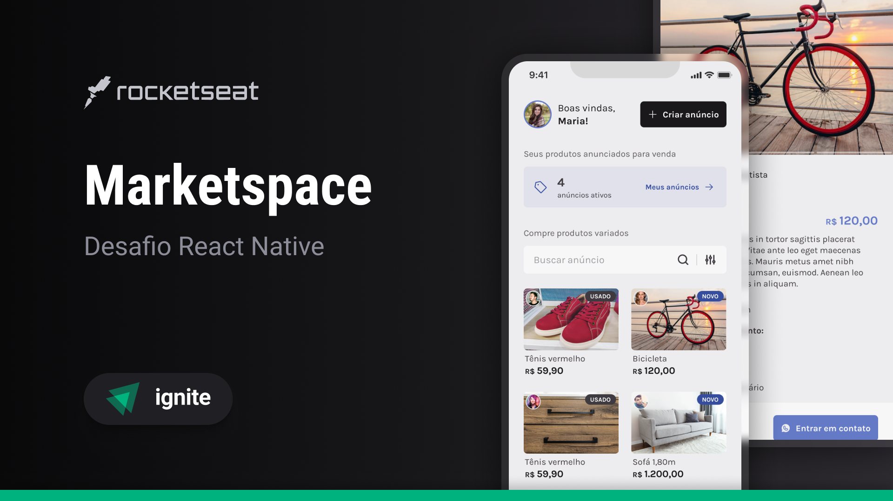
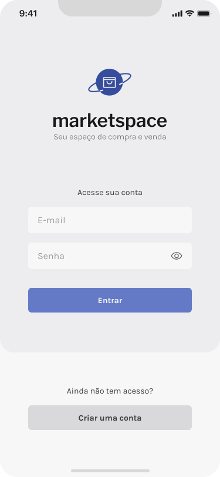
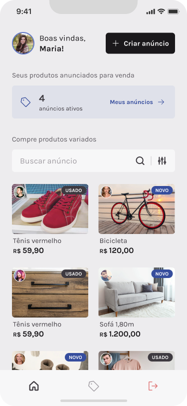
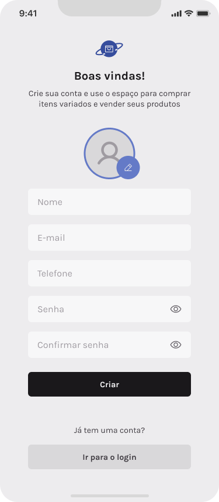
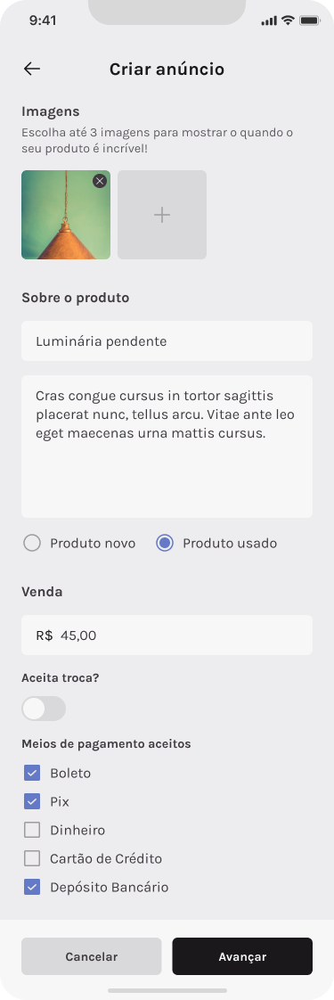
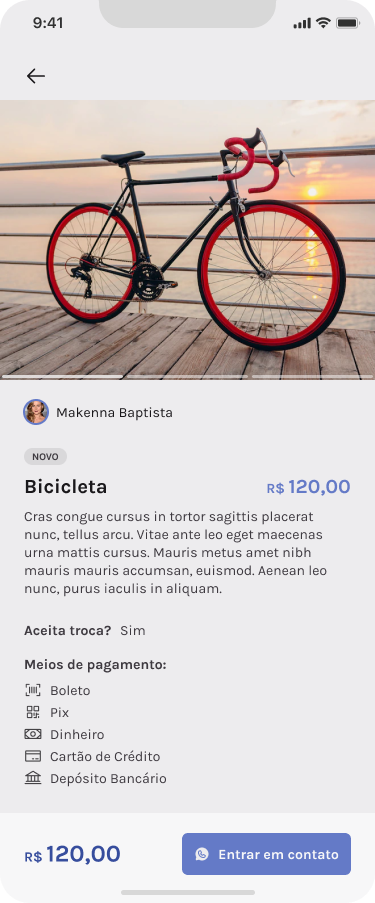

# Marketspace - Ignite | React Native

<span style="display: flex;">
 
</span>

<span style="display: flex; justify-content: center; align-items: center; gap: 10px">
	<a href="https://github.com/JosuePlacido/nlw-03/commits/master">
		
	</a>
	<a>
		
	</a>
</span>

## :computer: About <a id = "sobre"></a>

It'ss a marketplace application that allows users to log in, list items for sale, and search for products to contact the seller on whatsapp.
Users can also manage their listings, editing information as needed, such as details or prices.

<span style="display: flex;">
 
</span>

## 🎨 Layout <a id = "sobre"></a>

<span style="display: flex;align-items: flex-start; overflow-x: auto; gap: 5px;">
 
 
 
 
 
</span>

## Technologies <a id="tecs"></a>

### Requirements

- [Git](https://git-scm.com)
- [NodeJs](https://nodejs.org/en/)
- [Expo](https://expo.dev/)
- [Yarn](https://yarnpkg.com/) or [npm](https://www.npmjs.com/)

### :wrench: Languages, frameworks and libs

- [React](https://reactjs.org/)
- [React Native](https://reactnative.dev/)
- [TypeScript](https://www.typescriptlang.org/)
- [NativeBase](https://nativebase.io/)
- [Async Storage](https://reactnative.dev/docs/asyncstorage)
- [React Navigation](https://reactnavigation.org/)
- [React Navigation Native Stack](https://reactnavigation.org/docs/native-stack-navigator/)
- [Expo Google Fonts](https://github.com/expo/google-fonts)
- [Axios](https://axios-http.com/ptbr/docs/intro)
- [React Navigation Bottom Tabs](https://reactnavigation.org/docs/bottom-tab-navigator/)
- [Expo Image Picker](https://docs.expo.dev/versions/latest/sdk/imagepicker/)
- [React Hook Form](https://www.react-hook-form.com/)
- [Yup](https://github.com/jquense/yup)

## 🚀 Run project

```bash
	cd packages/marketspace

	# run the api
	cd api
	yarn dev # or npm run dev

	#app
	yarn start # width expo
```

adjust the file in `src/services/api` with api address

## Autor

<a alt="Linkedin" href="https://linkedin/in/josueplacido">
 
 <br />
 <sub><b>Josué Placido</b></sub></a>

Developed ❤️ by Josué Placido! 👋🏽

[](https://www.linkedin.com/in/josueplacido/)
[](mailto:juplacido.jnr@gmail.com)
[](mailto:ozzyplacidojunior@hotmail.com)
